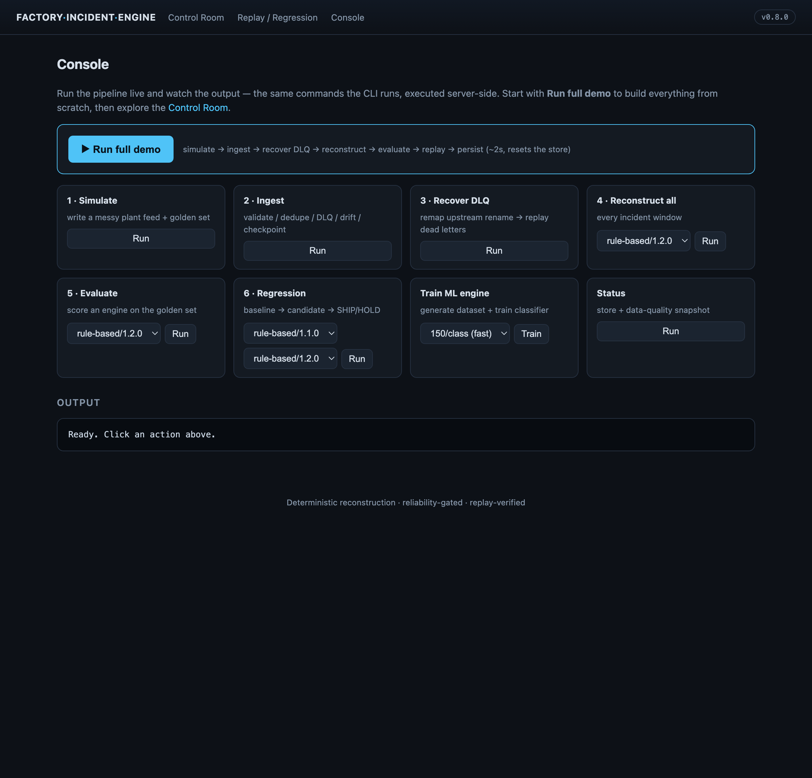
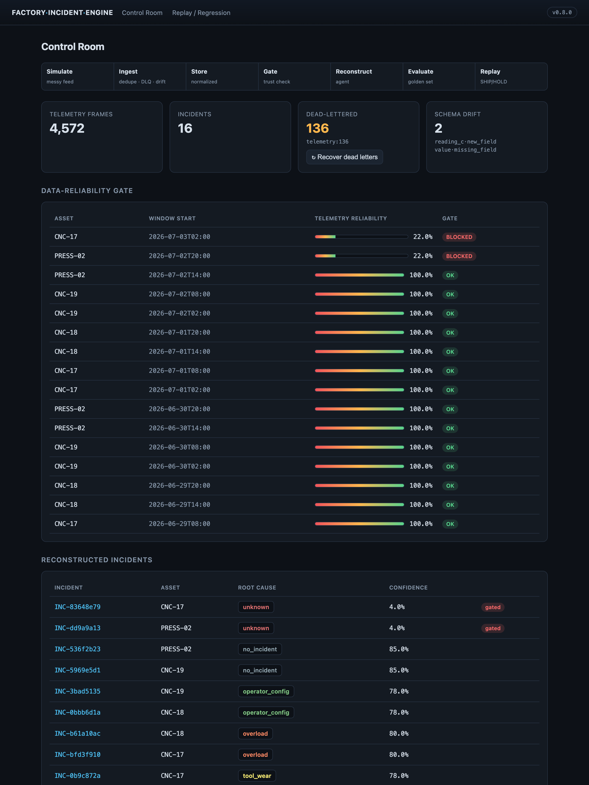
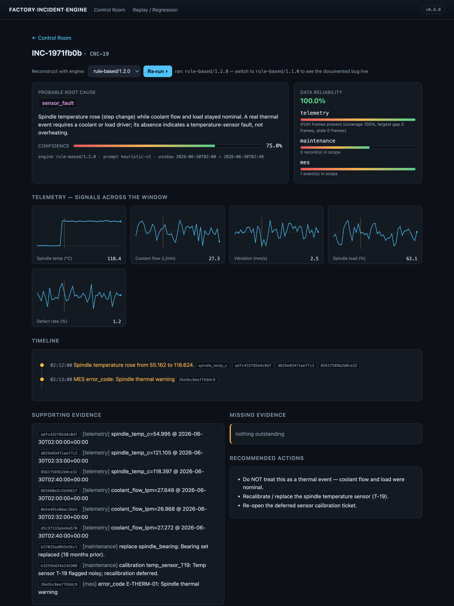
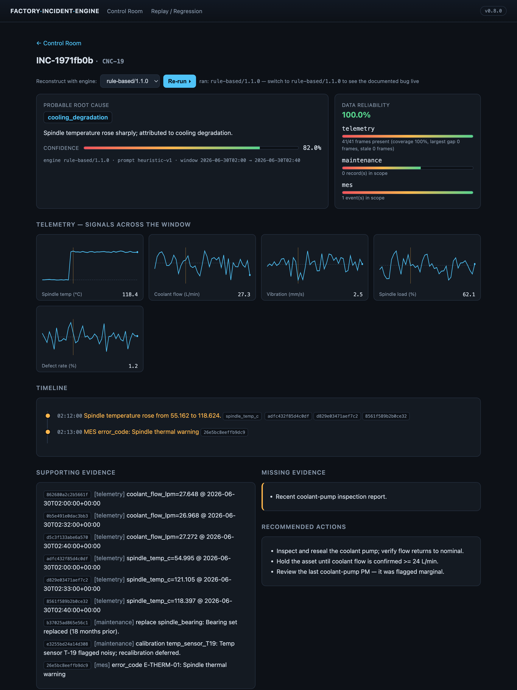
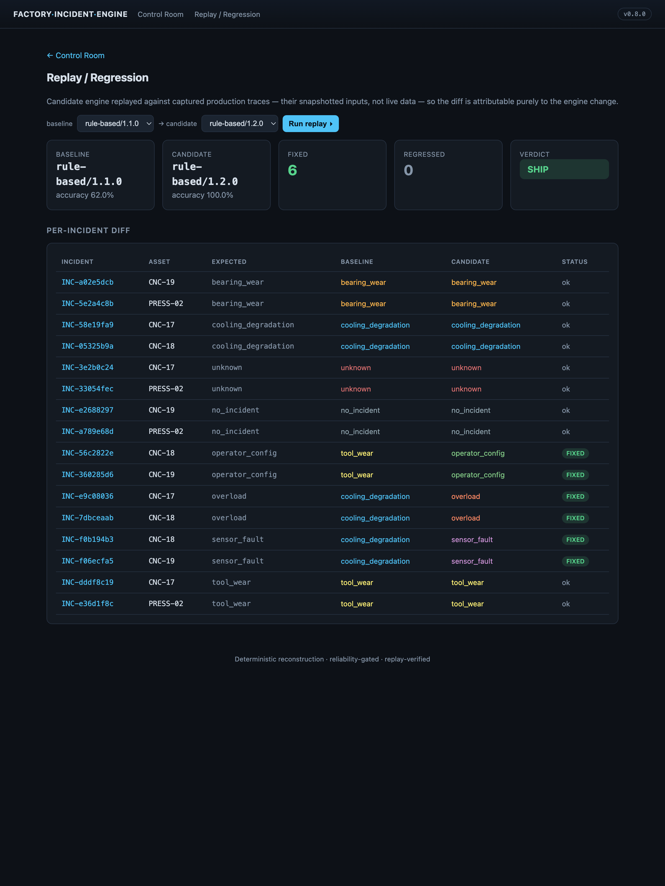

# Factory Incident Engine

Reconstructs manufacturing incidents from messy plant telemetry — and, more
importantly, does it the way you'd have to for a real deployment: with a
fault-tolerant ingestion layer, a data-quality gate that refuses to act on
untrustworthy data, an evaluation harness with a labeled golden set, and
**deterministic replay so a proposed change can be proven safe before it ships.**

The whole thing runs offline in one command. No API keys, no external services.

```
make demo      # simulate a messy plant feed → ingest → reconstruct → evaluate → replay
make serve     # explore it in the control-room UI at http://127.0.0.1:8000
```

---

## Why this exists

Diagnosing a machine failure is the easy part. The hard part — the part that
decides whether an agent survives contact with a factory — is everything around
it:

- the telemetry feed is **duplicated, out-of-order, out-of-range, and changes
  schema without warning**;
- some windows have **too little data to trust**, and acting anyway is worse
  than saying "I don't know";
- and when you improve the model, you need to know **whether the fix breaks
  anything that already worked.**

This project is built around that chain, not around the chatbot on top of it.

## The loop

The single most important thing here is the closed loop from *messy data* to
*a change you can ship with confidence*:

```
 simulate ─▶ INGEST ─▶ normalized store ─▶ reliability GATE ─▶ reconstruct ─▶ EVALUATE
 (messy)     │  dedupe / DLQ / drift              │  block if              │  vs golden set
             │  crash-safe checkpoint             │  data untrusted        ▼
             ▼                                     ▼                   a WRONG answer
        recover DLQ                          skip, don't guess              │
        (fix → replay)                                                      ▼
                                                                     REPLAY the captured
                                                                     trace vs a new engine
                                                                            │
                                                                            ▼
                                                                    REGRESSION report
                                                                    fixed? regressed? → SHIP / HOLD
```

Every reconstruction snapshots the exact evidence it saw into a **run trace**, so
replay is deterministic: a candidate engine is fed the *same inputs* the old one
saw, and the diff is attributable purely to the change.

## The honest failure (start here)

The repository ships a **real, documented bug** and the machinery that catches it.

`rule-based/1.1.0` diagnoses any spindle-temperature rise as **cooling
degradation**. That's plausible and often right — but it's wrong for a
**temperature-sensor fault**, where the reading climbs while coolant flow and
load stay perfectly nominal. On that incident the buggy engine would confidently
dispatch a crew to reseal a coolant pump that was never the problem.

The evaluation harness catches it (groundedness stays high — it *does* cite real
readings — but the root cause is wrong). `rule-based/1.2.0` fixes it by requiring
a corroborating coolant-flow drop before blaming cooling. Then replay proves the
fix is safe:

```
rule-based/1.1.0 → rule-based/1.2.0:  accuracy 62% → 100%  |  fixed 6, regressed 0  ⇒ SHIP
```

Run the reverse and you get `HOLD` with 6 regressions. That gate is the point.
See [`docs/failure-model.md`](docs/failure-model.md).

## What `make demo` actually shows

```
1. SIMULATE     4,807 raw telemetry lines with injected mess
                (dupes, out-of-order, impossible values, malformed, future ts, schema drift)
2. INGEST       4,560 inserted · 98 deduped · 149 dead-lettered (by reason) · drift logged
3. RECOVER DLQ  fix an upstream field rename → replay dead letters → 13 recovered
4. RECONSTRUCT  buggy engine v1.1.0 → 6 confidently-wrong diagnoses
5. EVALUATE     v1.1.0 acc=62%  vs  v1.2.0 acc=100%   (groundedness 1.00)
6. REPLAY       candidate v1.2.0 on captured traces → fixed 6, regressed 0 ⇒ SHIP
7. FINALIZE     persist incidents for the UI
```

## The control-room UI (`make serve`)

An interactive, zero-dependency UI (stdlib `http.server` + vanilla JS, no build
step) that *drives* the machinery, not just displays it.

**Console** — run any pipeline stage (or the whole demo) live from the browser
and watch the output; the same commands the CLI runs, executed server-side.
Great for a walkthrough: click **Run full demo** to build everything from
scratch, then explore.



**Control room** — pipeline overview, the data-reliability **gate** (note the two
`BLOCKED` windows where the agent refuses to act on sparse telemetry), and every
reconstructed incident:



**Incident** — server-rendered telemetry charts (you can *see* the failure
signature), grounded evidence, timeline, reliability, and an **engine switcher**
that re-runs reconstruction live. Here the fixed engine correctly calls it a
**sensor fault** — temperature steps up while coolant flow stays nominal:



Switch the engine dropdown to `rule-based/1.1.0` and the **documented bug**
appears live — the same evidence is now misdiagnosed as cooling degradation:



**Replay / regression** — pick any baseline and candidate engine and run the diff
on demand → SHIP/HOLD:



## Quickstart

```bash
pip install -e .                   # installs the `fie` command (pydantic + jinja2)
# or: pip install -r requirements.txt   # deps only; then use `python -m fie.cli ...`
make demo                          # the whole loop, ~2s, fully offline
make serve                         # control-room UI
make test                          # 41 tests
```

> Every `fie <cmd>` below also works as `python -m fie.cli <cmd>` without
> installing the package (that's what the Makefile uses).

Docker:

```bash
docker compose up --build          # runs the demo, then serves the UI on :8000
```

Individual stages are separate commands too:

```bash
fie simulate --reset       fie ingest        fie recover-dlq
fie reconstruct-all        fie status        fie eval
fie regression --baseline rule-based/1.1.0 --candidate rule-based/1.2.0

# swappable backends (same eval/replay harness scores all of them)
fie generate-dataset --n-per-class 500     # build a large labeled dataset
fie train --n-per-class 500                # train the ML engine -> data/models/
fie eval --engine ml                       # score the trained classifier
export XAI_API_KEY=...                      # free key from https://console.x.ai
fie reconstruct-all --engine grok          # or --engine claude (ANTHROPIC_API_KEY)
```

Every LLM/ML path falls back to the deterministic rule engine on any error, so
the demo, tests, and CI never require a key or a network.

## Architecture

| Layer | Module | What it does |
|---|---|---|
| Simulator | `fie/simulator/` | Deterministic plant with 8 physically-distinct failure modes + injected data mess |
| Ingestion | `fie/ingestion/` | Validate → dedupe → DLQ → schema-drift → normalize; crash-safe checkpoints |
| Store | `fie/store.py` | Normalized SQLite (Postgres-compatible DDL); idempotent upserts |
| Reliability | `fie/reliability.py` | Per-source score + deployment **gate** |
| Agent | `fie/agent/` | Toolbox + 3 interchangeable engines: rule-based (v1.1/v1.2), trained ML classifier, and LLM (Grok/Claude) |
| ML | `fie/ml/` | Dataset generation + training for the ML engine (shared feature extractor → no train/serve skew) |
| Evaluation | `fie/eval/` | Golden set + correctness / groundedness / timeline / tool-usage / abstention |
| Replay | `fie/replay/` | Deterministic replay of captured traces + regression report |
| UI | `fie/web/` | Zero-dependency control room (stdlib `http.server`) |

Deeper notes in [`docs/`](docs): [architecture](docs/architecture.md) ·
[data model](docs/data-model.md) · [evaluation](docs/evaluation.md) ·
[failure model](docs/failure-model.md).

A full study + interview-prep knowledge base lives in [`prep/`](prep) — concept
guides, a code walkthrough, a "how to change X" cookbook, and interview drills.

## Design decisions worth defending

- **The engine is a pure function of an `EvidenceBundle`.** That purity is what
  makes replay deterministic and evaluation reproducible.
- **The gate can veto the agent.** Below a reliability threshold, reconstruction
  returns `blocked` with an explanation instead of a guess. Judgment > coverage.
- **The reasoning backend is a one-flag swap.** The same reconstruction contract
  is served by a deterministic rule engine (default), a trained sklearn
  classifier (`--engine ml`), or an LLM — **Grok** (xAI, OpenAI-compatible, works
  with the free key) or **Claude**. Choosing one is a deployment decision, not a
  rewrite, and all are scored by the same eval + replay harness. Every LLM/ML path
  falls back to the rule engine on any error, so tests and CI never touch the
  network.
- **Nothing is silently dropped.** Every rejected record lands in the DLQ with a
  machine-readable reason and can be replayed after a fix.

## Testing

`pytest` covers the edge cases that matter in ingestion (idempotent crash
recovery, every DLQ reason, drift, naive-timestamp rejection), the reliability
gate, per-scenario classification, grounding (no invented citations), and the
full eval/replay/regression path. CI runs the suite plus the evaluation gate on
3.11 and 3.12.

## License

MIT — see [LICENSE](LICENSE).
